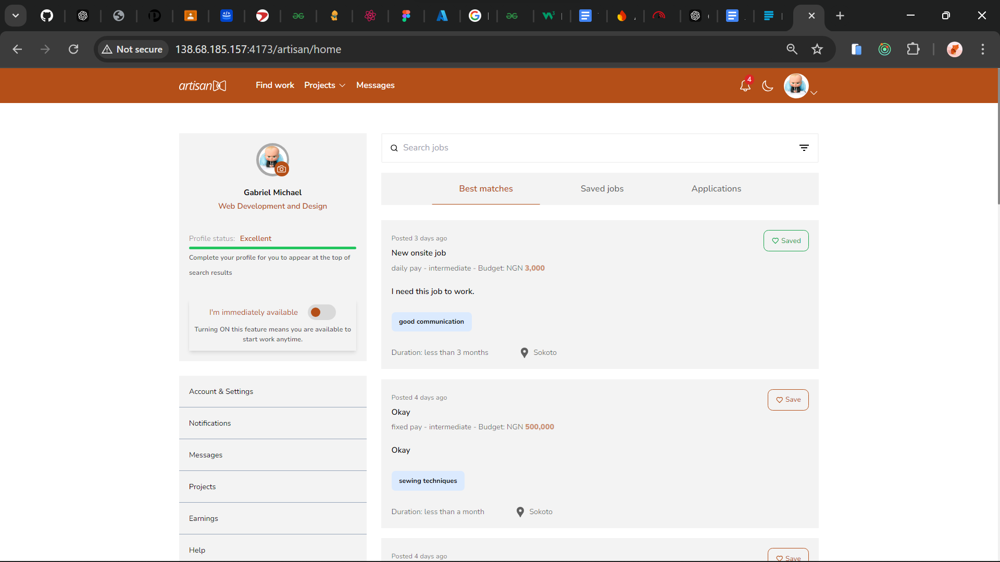

  <h3>Hello world🚀🚀🚀🚀</h3>
   
   

- 👋 Hi, I’m **`@codewitgabi`**
- 👀 I’m interested in `The Internet`
- 🌱 I’m currently working on `dRello - An AI blog application`
- 💞️ I’m looking to collaborate on Fullstack web applications.
- 📫 How to reach me:
  - 09020617734
  - facebook; Michael Gabriel

 
 

<!---
codewitgabi/codewitgabi is a ✨ special ✨ repository because its `README.md` (this file) appears on your GitHub profile.
You can click the Preview link to take a look at your changes.
--->

---

**`✨✨Languages and Tools✨✨`**

 

 
  

---

`✨✨Github Stats✨✨`

 

  
<a href="https://github.com/codewitgabi/github-stats">

---

  

  

---

  

   

  

---

**`Latest project`**

 

